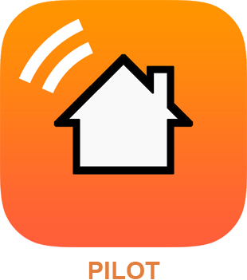

Description 
===

Plugin officiel de l'application Pilot. Ce plugin permet de paramétrer Pilot en un clic et d'envoyer des notifications PUSH de Jeedom vers Pilot.

Localisation
====

Déclenchez un scénario en fonction de votre localisation. Vous pouvez alors, par exemple, ordonner à votre installation de fermer vos volets automatiquement dès lors que vous quittez votre domicile.

Favoris
====

Retrouvez vos équipements favoris dans l’onglet « Favoris ». Pas la peine de vous encombrer de vos dizaines d’équipements domotiques, accéder directement et simplement à vos favoris.

Les commandes des comptes
=========================

