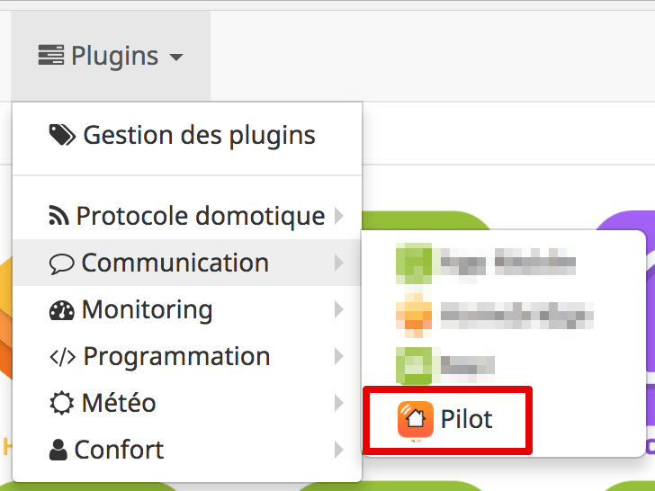
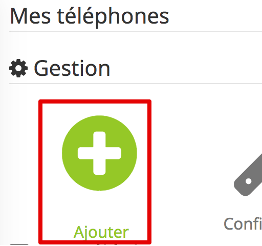
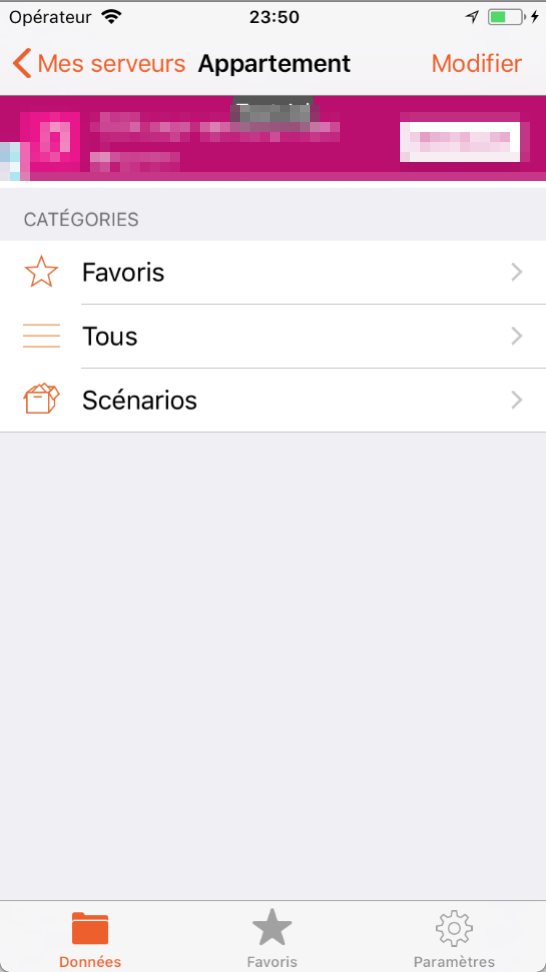
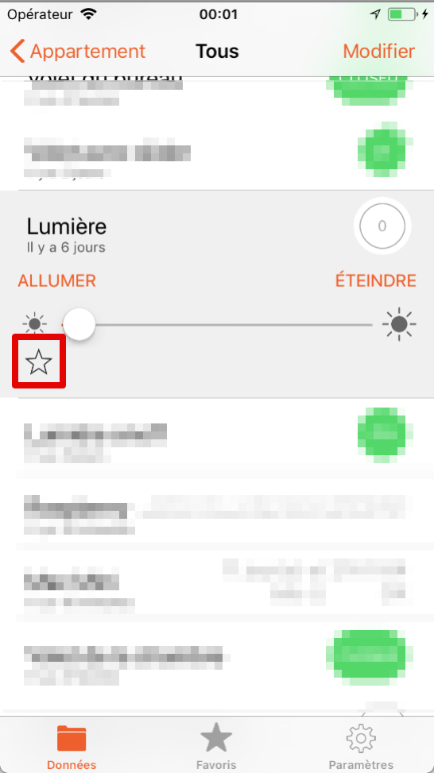
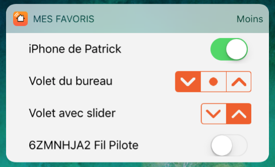
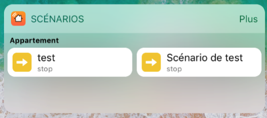
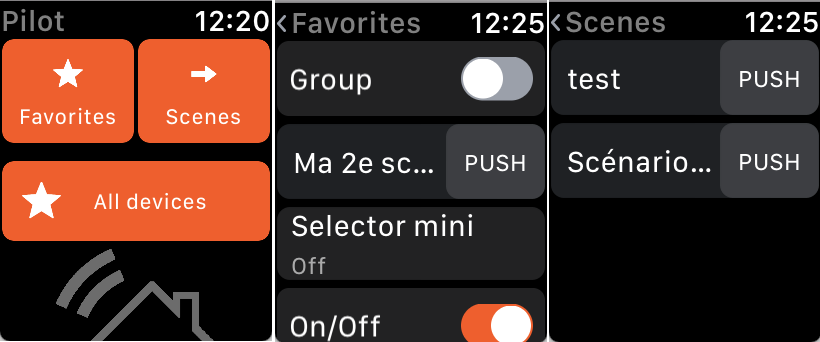
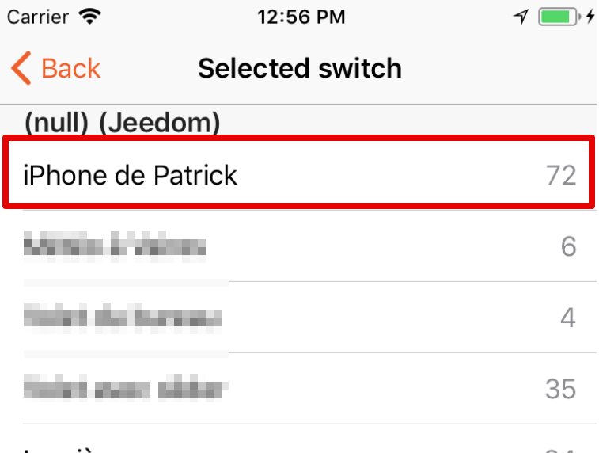

Plugin officiel de l'application [Pilot sur iOS](https://pilot.patrickferreira.com). Ce plugin permet de paramétrer Pilot en un clic et de créer un équipement virtuel qui vous permettra, via l'application, d'envoyer des notifications et déclencher des événements basés sur la localisation de l'appareil.

Présentation de l'application
=

Prenez le contrôle de votre maison domotique !

Pilot vous permet de prendre le contrôle de votre installation domotique : allumer la lumière, ouvrir les volets, fermer la porte, envoyer un message lorsque vous quittez le domicile, etc. Toutes ces actions, et bien plus encore, directement sur votre iPhone.

À la maison, où en déplacement, Pilot vous permet de :
* Contrôler votre maison domotique, grâce à une interface claire et intuitive
* Vous connecter à votre serveur Jeedom, avec la possibilité de se connecter simultanément à plusieurs serveurs
* Voir le statut et contrôler vos objets connectés
* Voir tous vos favoris en un seul endroit, et même depuis le centre de notifications de l'iPhone
* Déclencher un scénario depuis le centre de notifications
* Déclencher une action en fonction de la localisation de votre iPhone. Définissez plusieurs emplacements et déclenchez des actions en fonction de ces emplacements !
* Visualiser vos caméras
* Visualiser l'historique de certains équipements (bientôt)
* Filtrer vos équipements par catégorie, et par objet
* Envoyer des notifications PUSH
* Utiliser votre watch pour contrôler vos équipements

Pilot a été conçu spécifiquement pour utiliser le service de localisation de votre iPhone. Vous pouvez localiser votre iPhone, et déclencher une action en fonction (nécessite un achat in-app).

L'utilisation continue du GPS en tâche de fond peut réduire considérablement la durée de vie de la batterie. 

Fonctionnalités
=

Pilot propose une version gratuite et un achat in-app "Pilot Premium".

Découvrez ci-dessous toutes les fonctionnalités proposées.

| Pilot                                    | Free     | Premium  |
| ---------------------------------------- | -------- | -------- |
| Nombre d'équipements connectés en simultané | Illimité | Illimité |
| Nombre de localisations                  | 0        | Illimité |
| Serveurs max paramétrés en simultané     | 1        | Illimité |
| Récupération de l'état des équipements   | Oui      | Oui      |
| Contrôle des équipements ON/OFF          | Oui      | Oui      |
| Contrôle des équipements avec variateur  | Oui      | Oui      |
| Création de favoris                      | Oui      | Oui      |
| Version Apple Watch                      | Oui      | Oui      |
| Recherche d'équipements                  | Oui      | Oui      |
| Service de géolocalisation               | Non      | Oui      |
| Envoi de notifications PUSH              | Non      | Oui      |
| Widget : Favoris                         | Non      | Oui      |
| Widget : Scénarios                       | Non      | Oui      |
| Tri des objets et des équipements        | Non      | Oui      |
| Affichage de publicités                  | Oui      | Non      |
| Soutien pour les développements futurs   | Non      | Oui ! <3 |

Compatibilité avec Jeedom
=

Pilot utilise les types génériques définis dans JEEDOM. Si un équipement n'est pas associé à un type générique, alors l'équipement sera  visible en lecture seule, mais il sera impossible de le contrôler.

[Plus d'informations sur les types génériques.](https://www.jeedom.com/blog/3327-application-mobile-les-types-generiques/)

Tableau des compatibilités
-

#### Chauffage

| Type générique                  | Sous-type | Compatible ? |
| ------------------------------- | --------- | ------------ |
| Chauffage fil pilote Etat       | Info      | Oui          |
| Chauffage fil pilote Bouton     | Action    | Non          |
| Chauffage fil pilote Bouton OFF | Action    | Oui          |
| Chauffage fil pilote Bouton ON  | Action    | Oui          |

#### Généric

| Type générique                        | Sous-type | Compatible ? |
| ------------------------------------- | --------- | ------------ |
| Générique                             | Info      | Basique      |
| Choc                                  | Info      | Basique      |
| Détection de fumée                    | Info      | Basique      |
| Fenêtre                               | Info      | Basique      |
| Humidité                              | Info      | Basique      |
| Inondation                            | Info      | Basique      |
| Luminosité                            | Info      | Basique      |
| Ne pas tenir compte de cette commande | Info      | Basique      |
| Porte                                 | Info      | Basique      |
| Présence                              | Info      | Basique      |
| Puissance électrique                  | Info      | Basique      |
| Sabotage                              | Info      | Basique      |
| Température                           | Info      | Basique      |

#### Lumière

| Type générique     | Sous-type | Compatible ? |
| ------------------ | --------- | ------------ |
| Lumière couleur    | Info      | Oui          |
| Lumière Etat       | Info      | Oui          |
| Lumière Bouton Off | Action    | Oui          |
| Lumière Bouton On  | Action    | Oui          |
| Lumière Couleur    | Action    | Non          |
| Lumière Mode       | Action    | Non          |
| Lumière Slider     | Action    | Oui          |
| Lumière Toggle     | Action    | Oui          |

#### Mode

| Type générique | Sous-type | Compatible ? |
| -------------- | --------- | ------------ |
| Mode Info      | Info      | Non garanti  |
| Mode Action    | Action    | Non garanti  |

#### Portail/Garage

| Type générique                  | Sous-type | Compatible ? |
| ------------------------------- | --------- | ------------ |
| Garage état ouvrant             | Info      | Oui          |
| Portail état ouvrant            | Info      | Oui          |
| Portail ou garage bouton toggle | Action    | Oui          |

#### Prise

| Type générique   | Sous-type | Compatible ? |
| ---------------- | --------- | ------------ |
| Prise Etat       | Info      | Oui          |
| Prise Bouton Off | Action    | Oui          |
| Prise Bouton On  | Action    | Oui          |
| Prise Slider     | Action    | Oui          |

#### Serrure

| Type générique        | Sous-type | Compatible ? |
| --------------------- | --------- | ------------ |
| Serrure Etat          | Info      | Oui          |
| Serrure Bouton Fermer | Action    | Oui          |
| Serrure Bouton Ouvrir | Action    | Oui          |

#### Sirène

| Type générique    | Sous-type | Compatible ? |
| ----------------- | --------- | ------------ |
| Sirène Etat       | Info      | Oui          |
| Sirène Bouton Off | Action    | Oui          |
| Sirène Bouton On  | Action    | Oui          |

#### Thermostat

| Type générique                  | Sous-type | Compatible ? |
| ------------------------------- | --------- | ------------ |
| Thermostat Température ambiante | Info      | Oui          |
| Thermostat consigne             | Action    | Bientôt      |

#### Volet

| Type générique         | Sous-type | Compatible ? |
| ---------------------- | --------- | ------------ |
| Volet BSO Etat         | Info      | Oui          |
| Volet Etat             | Info      | Oui          |
| Volet BSO Bouton Down  | Action    | Oui          |
| Volet BSO Bouton Up    | Action    | Oui          |
| Volet Bouton Descendre | Action    | Oui          |
| Volet Bouton Monter    | Action    | Oui          |
| Volet Bouton Slider    | Action    | Oui          |
| Volet Bouton Stop      | Action    | Oui          |

#### Caméra

| Type générique                  | Sous-type | Compatible ? |
| ------------------------------- | --------- | ------------ |
| Etat                            | Info      | Oui          |
| Mouvement caméra vers le bas    | Action    | Non          |
| Mouvement caméra vers la droite | Action    | Non          |
| Mouvement caméra vers la gauche | Action    | Non          |
| Mouvement caméra vers le haut   | Action    | Non          |
| Preset caméra                   | Action    | Non          |
| Stop caméra                     | Action    | Non          |
| Zoom caméra vers l'arrière      | Action    | Non          |
| Zoom caméra vers l'avant        | Action    | Non          |

Compatibilité avec les plugins Jeedom
-

| Nom du plugin | Compatible ?                      |
| ------------- | --------------------------------- |
| Caméra        | Récupération de l'état uniquement |
| Virtuel       | Oui                               |
| Z-Wave        | Oui, via les types génériques     |
| RFXCom        | Oui, via les types génériques     |
| Thermostat    | Bientôt                           |
| Weather       | Bientôt                           |

N'hésitez pas à [proposer la prise en charge de vos plugins favoris](https://pilot.patrickferreira.com/contactez-moi/).

Configuration du plugin Pilot
=

Après téléchargement du plugin, vous devez commencer par l'activer.

Ensuite, vous devez **créer un équipement**. Pour cela :

1. Accéder à la page "Plugins > Communication > Pilot"

2. Cliquer sur "Ajouter" pour créer votre premier appareil
   

3. Entrer un nom pour votre équipement, puis cliquer sur "D'accord"

4. Par défaut, l'équipement est automatiquement activé avec la configuration adéquate :

   - Activé : par défaut, afin de vous épargner un clic
   - Clé API : il est préferrable de laisser la valeur par défaut. Ne modifiez cette valeur que si vous souhaitez recevoir des notifications sur votre iPhone depuis 2 serveurs jeedom. Voir section "Réception des notifications depuis 2 serveurs JEEDOM"
   - Utilisateur : permet de définir quel utilisateur se connecte à l'application
   - QRCode : le QR code qui s'affiche à la droite de la fenêtre vous permettra de configurer l'application sur votre iPhone ou votre iPad.

   Une fois ces étapes réalisées, tout est OK pour effectuer le premier lancement de l'app sur iOS.

Premier lancement de l'app Pilot sur iOS
=

Si ce n'est pas déjà fait, [téléchargez l'application sur votre iPhone ou iPad](https://itunes.apple.com/fr/app/pilot-home-automation-client/id902546368?l=fr&ls=1&mt=8). Puis :

1. Scanner le QR code présent sur l'équipement créé sur Jeedom. Vous pouvez le faire de 2 manières :
   - En lançant Pilot et en suivant l'assistant de première connexion
   - Directement depuis l'appareil photo de votre appareil (uniquement sur iOS 11)
2. Finaliser la création du serveur, et voilà !

Fonctionnalités 
=

Pilot propose de nombreuses fonctionnalités à travers une interface simple et intuitive.

Contrôle d'un équipement
-

Pour contrôler un équipement, il suffit d'appuyer sur l'élément, afin d'afficher les contrôles complémentaires.

En fonction de l'équipement, plusieurs commandes peuvent apparaitre :

* Allumer
* Éteindre
* Baisser un volet
* Ouvrir un volet
* Stop
* Niveau d'intensité
* Poussoir
* Etc.

Il est également possible d'utiliser un swipe sur un équipement pour réaliser une action rapide :

* Swipe de la gauche vers la droite :
  * Allumer un équipement
  * Fermer un volet
* Swipe de la droite vers la gauche pour éteindre :
  * Eteindre un équipement
  * Ouvrir un volet

Création d'un favori
-

Pour créer un favori :

1. Appuyer sur un équipement
2. Appuyer sur le bouton en forme d'étoile

Un favori apparait automatiquement dans l'écran "Favoris" de Pilot.

Utilisation des widgets
-

*L'utilisation des widgets nécessite l'obtention de Pilot Premium.*

Pilot propose 2 widgets : **Mes favoris** et **Scénarios**

#### Petit conseil pour tous les utilisateurs

Les widgets "Mes favoris" et "Scénarios" sont présents sur le centre de notifications de votre appareil. Cela signifie que n'importe quelle personne qui utilise votre iPhone peut contrôler votre maison depuis le centre de notifications. D'un point de vue sécurité, ce n'est pas terrible.

Je vous recommande donc d'activer la **protection par Touch ID/Face ID et code**, proposée par Pilot en version Premium. En activant cette fonctionnalité, vous protégez votre domicile et vos données !

Une présentation de la fonctionnalité "Protection par Touch ID/Face ID et code" est disponible dans cette documentation.

#### Widget Mes favoris

Le widget "Mes favoris" propose les mêmes contrôles que ceux disponibles dans l'application. Par souci de simplicité, il n'est pas possible de définir l'intensité d'un équipement.

#### Widget Scénarios

Le widget "Scénarios" permet de déclencher rapidement un scénario. Il suffit d'appuyer sur un scénario pour le déclencher.

Utilisation de l'watch
-

Pilot est disponible sur l'watch pour contrôler vos équipements depuis votre poignet.

3 catégories disponibles :

* Favoris
* Scénarios
* Tous vos équipements

Ajout d'un deuxième serveur
-

*Nécessite l'obtention de Pilot Premium.*

Pour ajouter un deuxième serveur, ou un troisième, ou un quatrième, il vous suffit de réaliser les opérations suivantes :

1. Aller sur l'écran "Paramètres > Paramètres du serveur"
2. Appuyer sur le bouton "+" en haut à droite
3. Sélectionner le type de serveur souhaité. *Vous pouvez paramétrer plusieurs types de serveurs sans aucun souci !*
4. Suivre les instructions qui s'affichent et finaliser la création du serveur

Suppression d'un serveur
-

1. Aller sur l'écran "Paramètres > Paramètres du serveur"
2. Swiper de la droite vers la gauche, sur le serveur que vous souhaitez supprimer
3. Confirmer la suppression en appuyant sur "Supprimer"

Localisation
-

*Nécessite l'obtention de Pilot Premium.*

Avant toute chose, vérifiez que vous disposez de :

- Un serveur [Jeedom](https://www.jeedom.com/) en état de marche et accessible depuis internet ;
- Le plugin Pilot installé sur votre serveur ;
- L’application [« Pilot : client domotique »](https://itunes.apple.com/fr/app/pilot-home-automation-client/id902546368?l=fr&ls=1&mt=8) installée sur votre smartphone, et déjà connectée à votre serveur.

Dans le cadre de ce tutoriel, nous allons utiliser l’équipement initialement créé pour paramétrer l’application Pilot :

1. Lancer l’application « Pilot : client domotique » ;
2. Aller dans les « Paramètres », puis dans « Service de localisation » ;
3. S’il s’agit de la première localisation que vous créez, un écran de paramétrage s’affichera automatiquement. Sinon, appuyer sur le bouton « + » en haut à droite de l’écran ;
4. Entrer un nom pour votre localisation ;
5. Appuyer sur « Interrupteur », puis sélectionner l’équipement paramétré dans le plugin Jeedom.
   - Astuce : si vous le souhaitez, vous pouvez sélectionner n’importe quel autre équipement, du moment que celui-ci dispose de commandes ON et OFF. Pilot déclenchera un événement OFF lorsque vous quitterez la zone, et un événement ON quand vous arrivez dans la zone définie

6. Une fois sélectionné, vous revenez à l’écran précédent, et il vous suffit alors d’indiquer l’adresse de votre domicile, soit automatiquement en appuyant sur le bouton « Me localiser », ou manuellement en entrant l’adresse dans le champ dédié.

Et voilà ! Votre serveur Jeedom et votre application sont maintenant correctement paramétrés. Vous pouvez maintenant utiliser l’équipement Jeedom pour adapter vos scénarios et détecter lorsque le téléphone arrive, ou quitte le domicile !

Comme vous l’avez sans doute compris, l’interrupteur virtuel passe à « On » lorsque le smartphone détecte qu’il se trouve à domicile, et passe à « Off » lorsqu’il quitte le domicile. À partir de là, libre à vous de créer d’autres scénarii pour satisfaire vos cas d’usage !

[Retrouvez le tutoriel complet ici](https://pilot.patrickferreira.com/tutoriel-jeedom-localisation-iphone/), vous pouvez y déposer vos commentaires si vous le souhaitez.

Notifications PUSH 
-

*Nécessite l'obtention de Pilot Premium.*

Pour activer les notifications :

1. Lancer l’application « Pilot : client domotique » ;
2. Aller dans les « Paramètres », puis dans « Notifications PUSH » ;
3. Cocher la case "Notifications"
4. Et c'est tout ! Vous pouvez maintenant utiliser l'équipement créé dans Jeedom pour y envoyer des notifications.

Touch ID, Face ID et code
-

*Nécessite l'obtention de Pilot Premium.*

1. Lancer l’application « Pilot : client domotique » ;
2. Aller dans les « Paramètres », puis dans « Touch ID et code » ;
3. Appuyer sur "Activer le code" et suivre les instructions.

En activant cette fonctionnalité, vos données seront protégées et un code vous sera demandé à chaque ouverture de Pilot.

Les widgets seront également protégés, et il vous faudra déverrouiller votre iPhone avant de pouvoir consulter les équipements de votre domicile.

Questions fréquentes
=

https://pilot.patrickferreira.com/foire-aux-questions/

Tutoriels et liens utiles
=

[Tutoriel : localisation à l'aide de votre iPhone](https://pilot.patrickferreira.com/tutoriel-jeedom-localisation-iphone/)

[Tutoriel : créer un raccourci avec Siri](https://pilot.patrickferreira.com/utiliser-les-actions-siri-avec-domoticz-et-jeedom/)

Tutoriel : envoi de notifications PUSH (bientôt)

[Site officiel de l'application Pilot sur iOS](https://pilot.patrickferreira.com/client-domotique/)

[Support sur le topic dédié sur le forum de Jeedom](https://www.jeedom.com/forum/viewtopic.php?f=112&t=33592)

Contact
=

[Formulaire de contact](https://pilot.patrickferreira.com/contactez-moi/)

